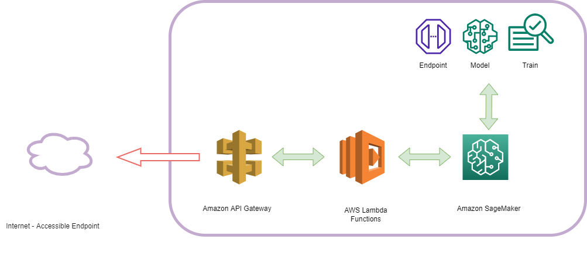

# MLOps - Titanic MachineLearning from Disaster (AWS Solution)

 A solution to build, train and deploy a random forest classifier in aws sagemaker, automating all the infrastructure with cloudformation.

## Task

 Build a complete solution to train and deploy an ML model on Amazon Web Services (AWS).

The services used were:

- Amazon SageMaker (for training and deploying an ML model)
- AWS Lambda (To invoke the endpoint and process requests)
- Amazon API Gateway (to create a Rest API and fully integrate with lambda and the ML endpoint)
- AWS CloudFormation (to automate the infrastructure deployment step)
- AWS SDK and CLI (to automate various tasks in the cloud)

## Summary

Cloud services have had a great impact on IT (information technology) in the last 10 years, due to the flexibility, scalability, reliability and security of their services. In this project, a complete architecture is proposed to train and deploy a Machine Learning model using AWS as a cloud provider. The model training was done by creating a job in SageMaker using a pre-built container Image (in this case, a scikit-learn image), and its deployment was done by creating an endpoint from a sagemaker configuration endpoint, a lambda function to preprocess the request and an API Gateway as a Rest API to expose the service to internet. The deployment infrastructure was automated with cloudFormation and the training infrastructure was automated with the python SDK.

## Functionality

use machine learning to create a model that predicts which passengers survived the Titanic shipwreck. This task is the toy task from kaggle for ML practitioners ( https://www.kaggle.com/c/titanic). A possible solution to this task (using a random forest classifier) is shown in the Titanic_Machine_Learning_from_Disaster.ipynb notebook. The hyperparameters and data pipeline are saved and used in the training stage. 

### Training Stage

rfClassifier_awsSolution.py and script_rfClassifier.py are the scripts where training stage is automated using python SDK. The result of this stage is an endpoint configuration where an enpoint can be deployed.

### Deployment stage

The cloudFormation-MLOps folder shows the templates needed to implement the infrastructure using cloudFormation, it also shows the lambda function to process the request and invoke the endpoint.
